# EyePop Python SDK Architecture

## Overview

The EyePop Python SDK provides access to EyePop.ai's inference (Worker API) and data management (Data API) services. It is async-first (aiohttp) with transparent sync wrappers, supporting authentication, request tracing, load balancing, and visualization.

---

## High-Level Architecture

```mermaid
graph TB
    subgraph "User Application"
        UC[User Code]
    end

    subgraph "EyePop SDK"
        Factory["EyePopSdk<br/>(Factory)"]

        subgraph "Worker API"
            WE["WorkerEndpoint<br/>(async)"]
            SWE["SyncWorkerEndpoint<br/>(sync wrapper)"]
            WJ["WorkerJobs<br/>(Upload, LoadFrom)"]
            LB["EndpointLoadBalancer"]
            Pop["Pop / Components"]
        end

        subgraph "Data API"
            DE["DataEndpoint<br/>(async)"]
            SDE["SyncDataEndpoint<br/>(sync wrapper)"]
            DJ["DataJobs<br/>(Upload, Import, Infer)"]
            WS["WebSocket Events"]
        end

        subgraph "Shared Core"
            EP["Endpoint<br/>(base class)"]
            Jobs["Job<br/>(base class)"]
            Auth["Auth & Token Mgmt"]
            Retry["Retry Handlers"]
            Trace["RequestTracer"]
            Metrics["MetricCollector"]
            Settings["Settings<br/>(pydantic)"]
            Syncify["Syncify<br/>(event loop bridge)"]
        end

        subgraph "Data Types"
            PT["Prediction Types"]
            AT["Asset / Dataset Types"]
            MT["Model Types"]
            Arrow["Arrow Schemas"]
        end

        Viz["EyePopPlot<br/>(matplotlib)"]
    end

    subgraph "EyePop Services"
        WorkerSvc["Worker Service<br/>(inference pipelines)"]
        DataSvc["Data API Service<br/>(datasets, models)"]
        ComputeSvc["Compute API<br/>(session mgmt)"]
        AuthSvc["Auth Service"]
    end

    UC --> Factory
    Factory --> WE
    Factory --> SWE
    Factory --> DE
    Factory --> SDE
    Factory --> Viz

    SWE -.->|wraps| WE
    SDE -.->|wraps| DE

    WE --> EP
    DE --> EP
    WE --> WJ
    WE --> LB
    WE --> Pop
    DE --> DJ
    DE --> WS

    EP --> Auth
    EP --> Retry
    EP --> Trace
    EP --> Metrics
    EP --> Settings

    SWE --> Syncify
    SDE --> Syncify

    WJ --> Jobs
    DJ --> Jobs

    WJ --> PT
    DJ --> AT
    DJ --> MT
    DJ --> Arrow

    WE -->|HTTP/JSON-L| WorkerSvc
    DE -->|HTTP/JSON| DataSvc
    DE -->|WebSocket| DataSvc
    EP -->|Token exchange| AuthSvc
    WE -->|Session mgmt| ComputeSvc
```

---

## Class Hierarchy

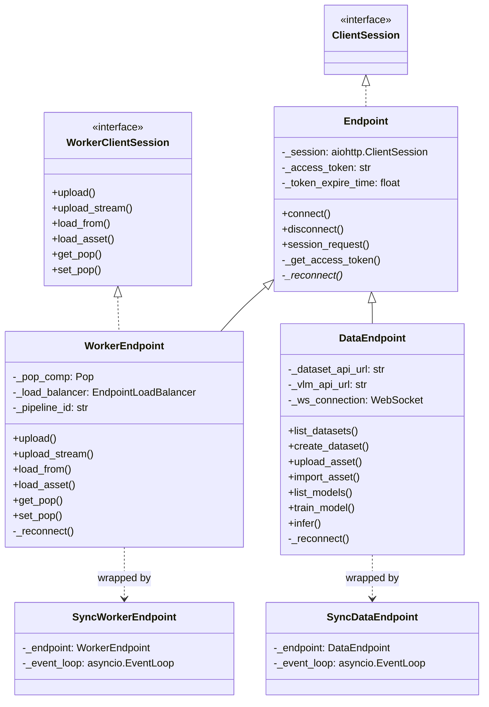

---

## Job Hierarchy

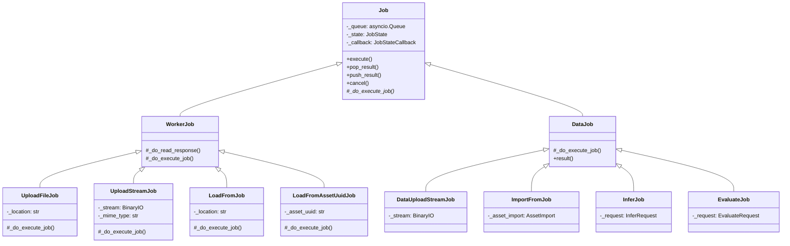

---

## Job State Machine

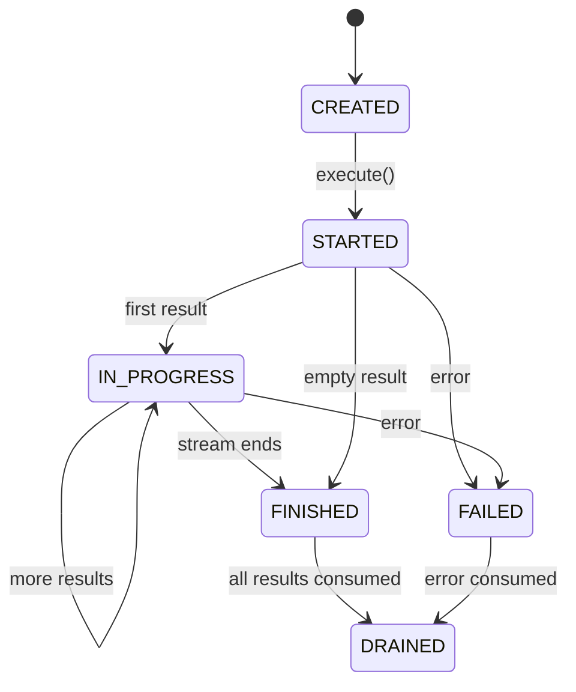

---

## Authentication Flow

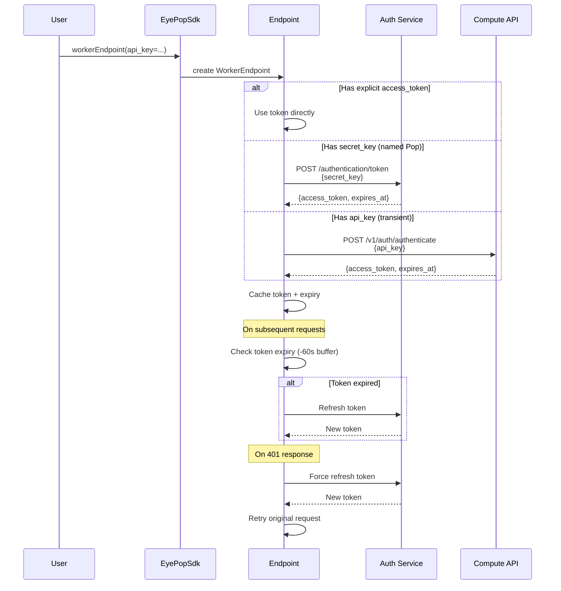

---

## Worker API: Inference Flow

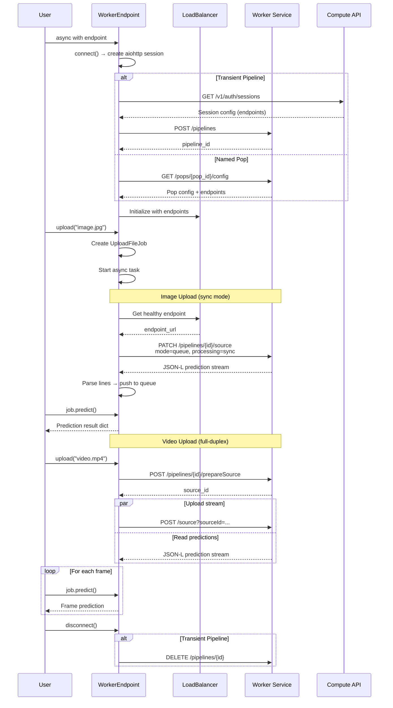

---

## Data API: Dataset & Model Flow

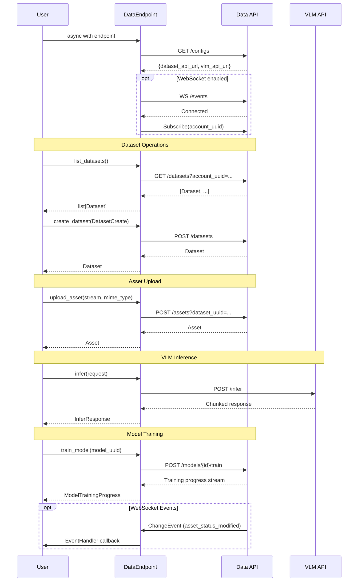

---

## Pop Component Pipeline

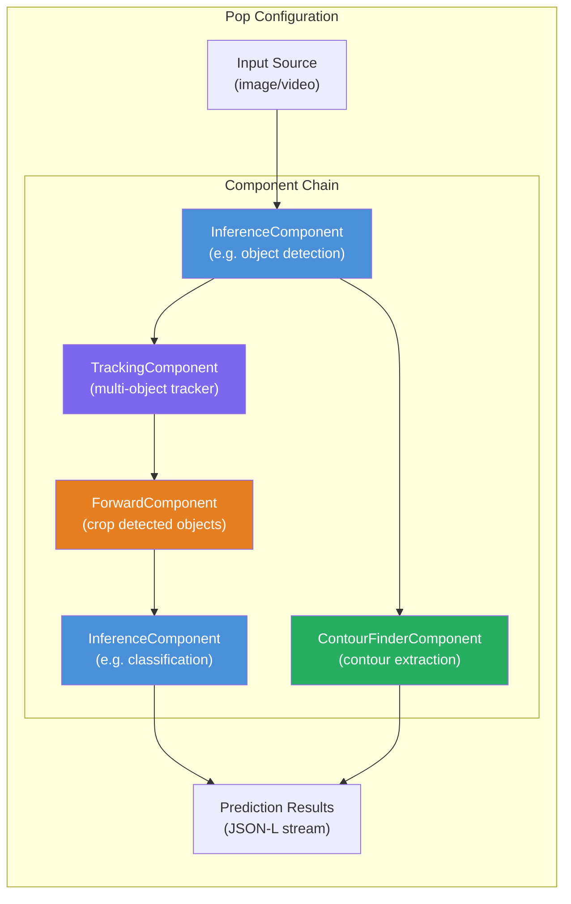

---

## Sync/Async Bridge

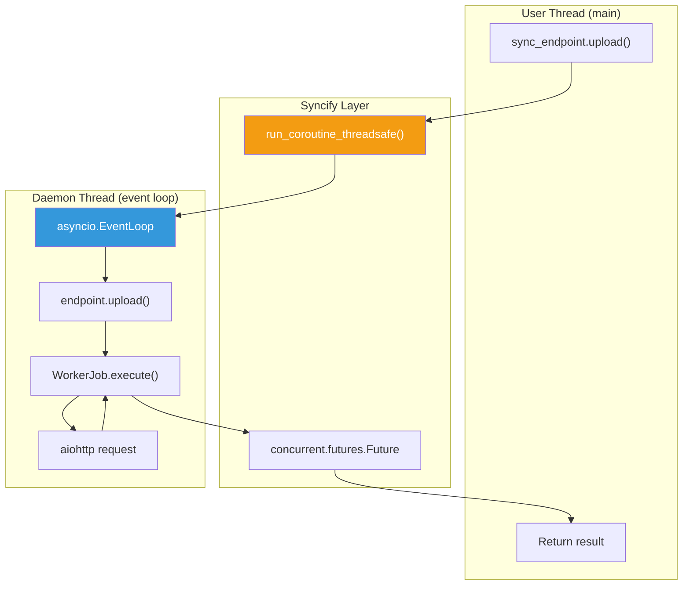

---

## Load Balancer & Retry

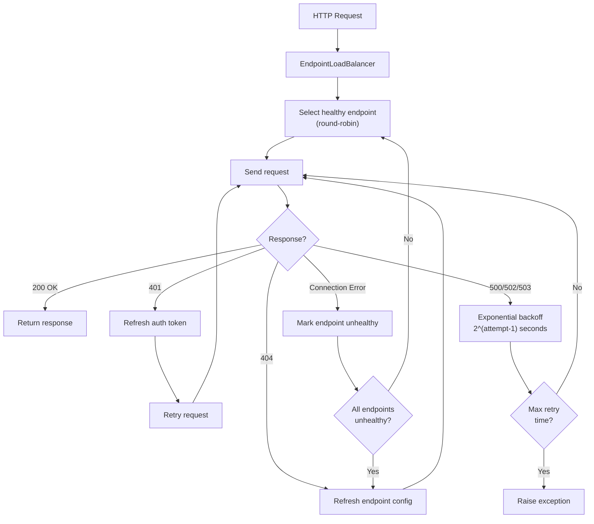

---

## Module Dependency Map

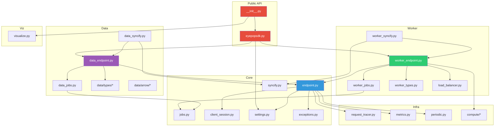

---

## Error Handling Hierarchy

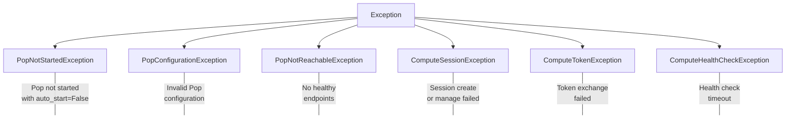

---

## Key Design Patterns

| Pattern | Where | Purpose |
|---------|-------|---------|
| **Factory** | `EyePopSdk.workerEndpoint()` / `dataEndpoint()` | Resolves auth, creates appropriate endpoint type |
| **Template Method** | `Job.execute()` → `_do_execute_job()` | Job lifecycle with subclass-specific execution |
| **Adapter** | `SyncWorkerEndpoint` / `SyncDataEndpoint` | Async-to-sync interface conversion |
| **Strategy** | Retry handlers per HTTP status | Pluggable error recovery strategies |
| **Observer** | WebSocket `EventHandler` callbacks | Real-time dataset/model change notifications |
| **Builder** | Pop component `forward` chaining | Composable inference pipeline configuration |
| **Semaphore** | `asyncio.Semaphore(job_queue_length)` | Backpressure on concurrent job submission |
| **Round-Robin** | `EndpointLoadBalancer` | Distribute requests across healthy endpoints |
